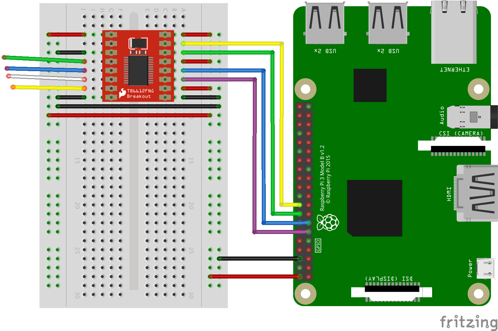

# Raspi Ruxpin!

Make a creepy old Teddy Ruxpin say whatever you want!

Entering text through the web interface will make Teddy Ruxpin say whatever you want with syncronized mouth movements.

## Introduction

This project was originally based on the [version](https://www.hackster.io/chip/c-h-i-p-py-ruxpin-5f02f1) constructed by the nice folks at NextThing, inc. Unfortunately, it appears as though they and their nifty $9 CHIP have both disappeared into the ether.

So, on that note, I've ported and rebuilt the project for use with a Raspberry Pi.


## What You'll Need
- Teddy Ruxpin
- RaspberryPi 3 (probably works on earlier versions, but unverified)
- Breadboard
- jumpers
- Sparkfun TB6612FNG H-Bridge Breakout

## Wiring


## update apt package lists
```sh
sudo apt-get update
```

## Setup git
```sh
sudo apt-get install git
```

## setup ssh key in github (optional)
```sh
ssh-keygen -t rsa -b 4096 -C "your_email@example.com"
```
```sh
cat ~/.ssh/id_rsa.pub
```
copy entire output of previous command
navigate to `https://github.com/settings/keys`
select "New SSH key"
follow instructions from there...

## Clone repo
```sh
git clone git@github.com:yamanote1138/raspi-ruxpin.git
cd raspi-ruxpin
```

## Install System Dependencies
```sh
sudo apt-get install python-setuptools python-dev python-alsaaudio python-pyaudio python-numpy python-bottle libttspico-utils
```
note: the following additional dependencies appear to be pre-installed (at least on Raspbian Buster)
`alsa-utils`
`build-essential`
`python-configparser`

## Configuration
make a copy of the default config and name it `main.cfg`
```sh
cp config/main.cfg.default config/main.cfg
```

using whatver editor tickles your fancy, set the GPIO pins to whatever you'd like
NOTE: the default config maps to the GPIO pins as wired in the attached fritzing diagram

## Operation
To start the application, run this script:

```sh
sudo python main.py
```

Assuming your RasPi is connected to WIFI or ethernet, you should see a message that looks similar to this:

```sh
---------
RASPI RUXPIN IS ONLINE!
In your browser, go to http://[ipaddress]:8080
---------
```

## Mac Local Dev notes
`brew install pyenv`
`pyenv install 2.7.13`
`brew install portaudio`
`pip install ConfigParser`
`pip install pyaudio`

Note: mac local dev hasn't been tested in several versions, just leaving the notes here for posterity
